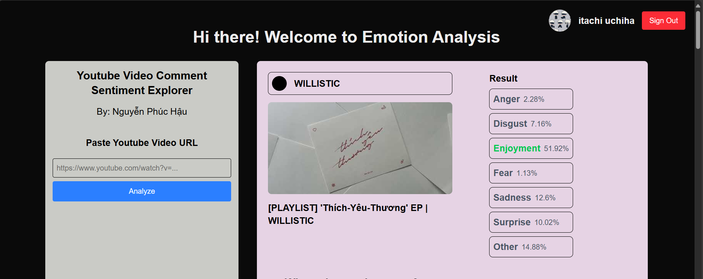
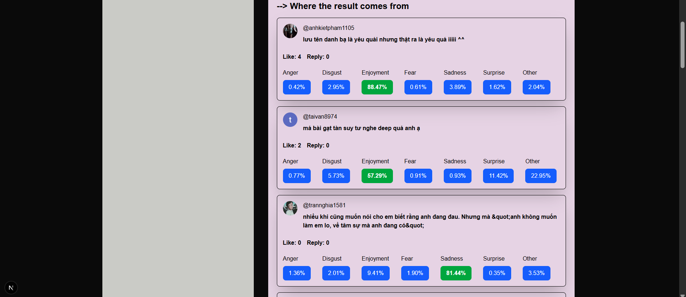
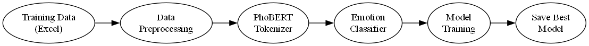
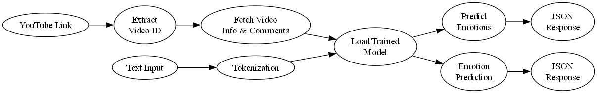
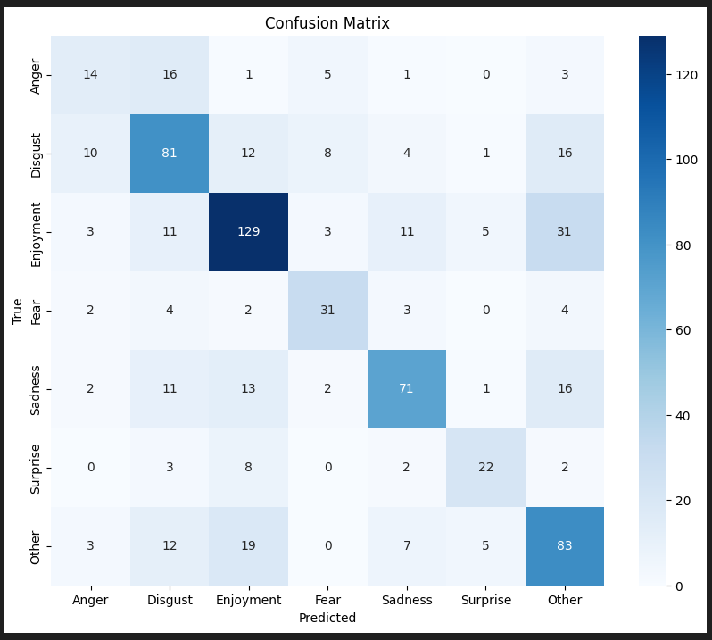

# 🚀 Emotion Analysis for Vietnamese Text

This project implements a deep learning model for emotion analysis in Vietnamese text, with both training pipeline and API endpoints for real-world applications.

## 📸 Screenshots

### 📌 Result analyze



### 📌 Comment Relevance



## 🔌 Pipeline Diagrams

### 📈 Training Pipeline



### 📈 API Pipeline



## 📈 Model Evaluation Results

-   Accuracy: 62,2%
-   F1-Score: 0.62
-   Confusion Matrix Results are available in `reports/model_evaluation.ipynb`



Detailed evaluation metrics for each emotion:

| Emotion   | Precision | Recall | F1-Score | Support |
| --------- | --------- | ------ | -------- | ------- |
| Anger     | 0.41      | 0.35   | 0.38     | 40      |
| Disgust   | 0.59      | 0.61   | 0.60     | 132     |
| Enjoyment | 0.70      | 0.67   | 0.68     | 193     |
| Fear      | 0.63      | 0.67   | 0.65     | 46      |
| Sadness   | 0.72      | 0.61   | 0.66     | 116     |
| Surprise  | 0.65      | 0.59   | 0.62     | 37      |
| Other     | 0.54      | 0.64   | 0.58     | 119     |

## 📦 Installation

### Option 1: Use venv

1. Clone the repository:

```bash
git clone https://github.com/PhucHau0310/Emotion-Analysis.git
cd EmotionAnalyze
```

2. Create and activate virtual environment:

```bash
python -m venv .venv
.\.venv\Scripts\activate
```

3. Install dependencies:

```bash
pip install -r requirements.txt
```

4. Install Graphviz (for pipeline visualization):
    - Download from: https://graphviz.org/download/
    - Add to system PATH

### Option 2: Use docker-compose

```bash
cd root project
docker-compose up --build
```

## 🧪 Usage

### Training

```bash
cd be/src
python scripts/train.py
```

### Running API Server

```bash
cd be
uvicorn src.main:app --reload
```

### API Endpoints

1. YouTube Comments Analysis:

```bash
POST /analyze
{
    "link": "https://www.youtube.com/watch?v=VIDEO_ID"
}
```

2. Text Analysis:

```bash
POST /predict
{
    "text": "Tôi rất vui khi gặp lại bạn!"
}
```

## 📁 Project Structure

```
EmotionAnalyze/
├── be/
│   ├── src/
│   │   ├── models/
│   │   ├── utils/
│   │   ├── scripts/
│   │   └── config/
│   ├── reports/
│   ├── notebooks/
│   └── tests/
├── requirements.txt
├── fe/ (next.js)
├── docker-compose.yml
└── README.md
```

## 🛠️ Environment Variables

Create a `.env` file in the root directory be:

```
YOUTUBE_API_KEY=your_api_key_here
```

## 🙋 Contributing

Pull requests are welcome. For major changes, please open an issue first to discuss what you would like to change.

## 👤 Authors

-   **Nguyễn Phúc Hậu** - _Initial work_
-   **Email:** haunhpr024@gmail.com
-   **Github:** PhucHau0310

## ❓ Acknowledgments

-   PhoBERT for providing pre-trained Vietnamese language model
-   FastAPI for the web framework
-   YouTube API for comment extraction capabilities
